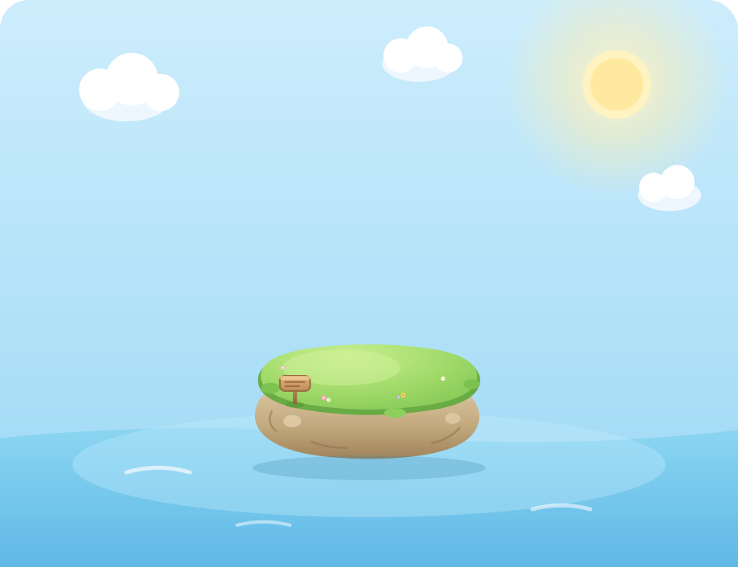
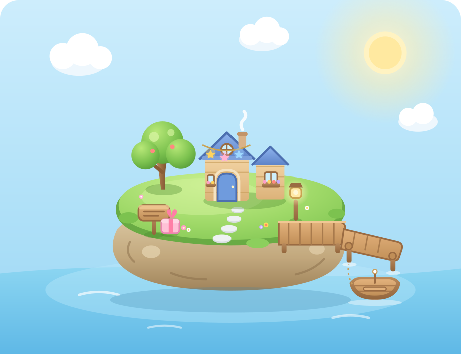
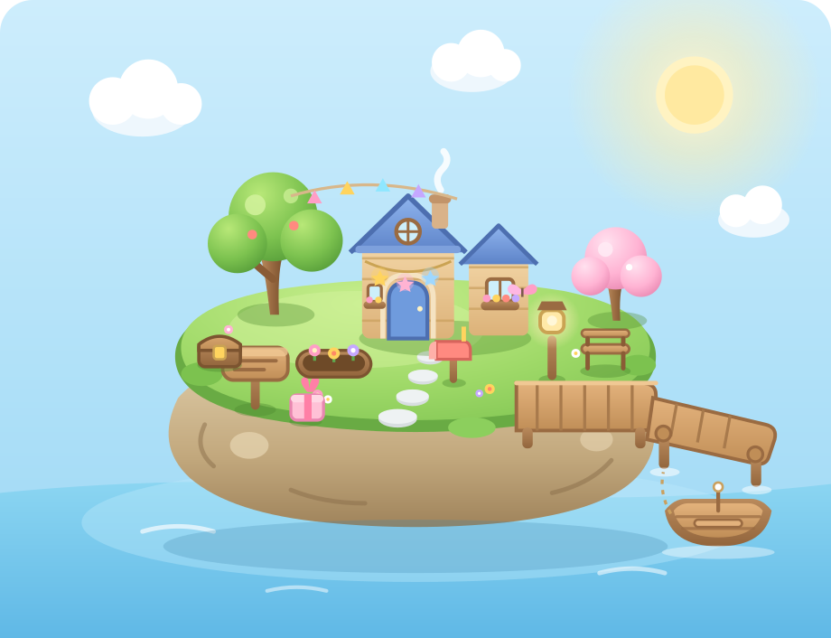

# 🏝️ 任務島 Task Island

> 把待辦變成一座慢慢長大的療癒小島。完成任務 → 獲得星星 → 星星飛進玻璃瓶 → 小島從 Lv.1 養成到 Lv.99。

一個溫柔的待辦養成 Web App。每完成一件事，就會得到彩色星星、餵養小島，讓它從一塊空地慢慢長成有小屋、碼頭、花園的小世界。毛茸茸的小熊「圓圓」會陪你聊心情、把任務拆小、給你打氣。

純前端、單頁應用，**無需後端**，打開 `index.html` 就能玩。

---

## 🌱 小島從 Lv.1 養到 Lv.99

| Lv.1 起點 | Lv.5 成形 | Lv.99 完整 |
| --- | --- | --- |
|  |  |  |

## ✨ 主要功能

| 功能 | 說明 |
| --- | --- |
| 🔐 登入流程 | 填姓名 + Email，進入「你的任務小島準備好了」歡迎頁 |
| 📝 任務與專注 | 新增每日任務、番茄鐘專注計時，完成就得彩色星星 |
| 🫙 星星瓶 | 真實玻璃質感的瓶子，星星受物理重力一顆顆飛進去堆積，是努力的回憶收藏 |
| 🏝️ 小島養成 | 星星讓小島從 Lv.1 升到 Lv.99，慢慢解鎖小樹、小屋、碼頭、小船、花樹等 |
| 🧸 圓圓陪聊 | 毛茸茸小熊陪你聊心情、拆任務、打氣、陪讀，200 句不重複的溫柔回應 |
| 🤝 好友互動 | 用 Email 加好友，互相點亮星星、拍照打卡、留言送貼圖鼓勵 |
| ☰ 功能選單 | 個人資料、加好友、任務日曆、成就徽章、專注紀錄、設定、關於 |

## 📈 小島成長路線

| 等級 | 解鎖內容 |
| --- | --- |
| Lv.1 | 小空島、草地、小花、小木牌 |
| Lv.2 | 石板小路、小樹、小燈 |
| Lv.3 | 溫馨小木屋 |
| Lv.4 | 木頭平台、小碼頭、小船 |
| Lv.5 | 朋友送的禮物、星星燈串 |
| Lv.8 ~ 99 | 小椅子、花圃、粉色花樹、郵筒、寶箱、彩旗、蝴蝶… |

## 🚀 線上體驗

部署到 GitHub Pages 後，網址會是：

```
https://judy7113.github.io/taskstar/
```

（開啟 GitHub Pages 的步驟見下方 [DEPLOY.md](DEPLOY.md)）

## 💻 本機執行

不需要安裝任何東西，直接用瀏覽器打開即可：

```bash
# 方法一：直接雙擊 index.html

# 方法二：用簡易伺服器（建議，避免某些瀏覽器擋本地檔案）
python3 -m http.server 8000
# 然後開 http://localhost:8000
```

## 🗂️ 檔案結構

```
taskstar/
├── index.html      # 頁面結構（登入、首頁、小島、星星瓶、好友、圓圓陪聊等）
├── style.css       # 全部樣式（3D 療癒風、動畫、響應式）
├── app.js          # 主要邏輯（任務、等級、星星、好友、選單、圓圓對話）
├── jar.js          # 星星瓶物理引擎（重力、碰撞、堆疊）
├── assets/
│   └── star-gem.png  # 星星圖示
├── README.md
└── DEPLOY.md       # GitHub Pages 部署教學
```

## 🛠️ 技術

- 純 **HTML / CSS / JavaScript**，零框架、零打包工具、零相依套件
- 小島、小熊、道具全部是手繪 **SVG**（向量，任意縮放不失真）
- 星星瓶用 **Canvas** 自製輕量物理引擎
- 登入資訊存在分頁 session，重整不需重填

## 📱 支援

桌機與手機瀏覽器皆可，版面自動切換為單欄手機版。

---

🌈 願這座小島，陪你把每一個普通的一天，都過成值得收藏的樣子。
